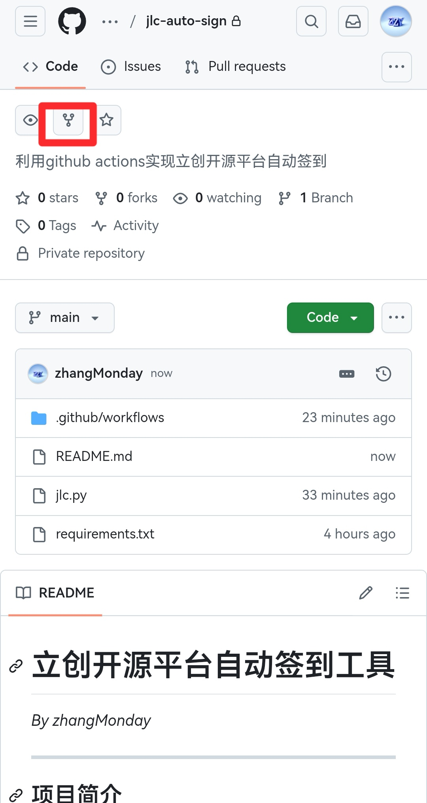
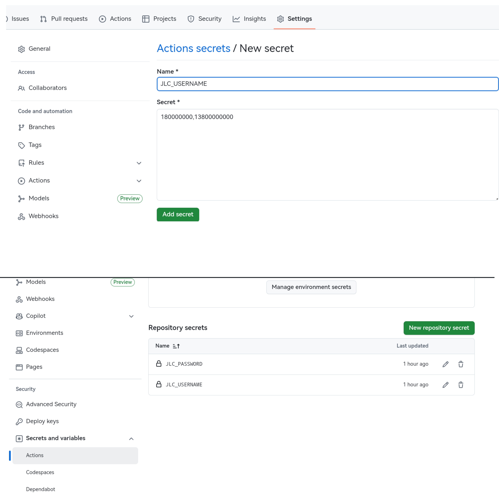
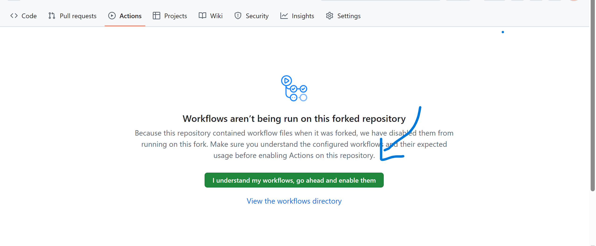
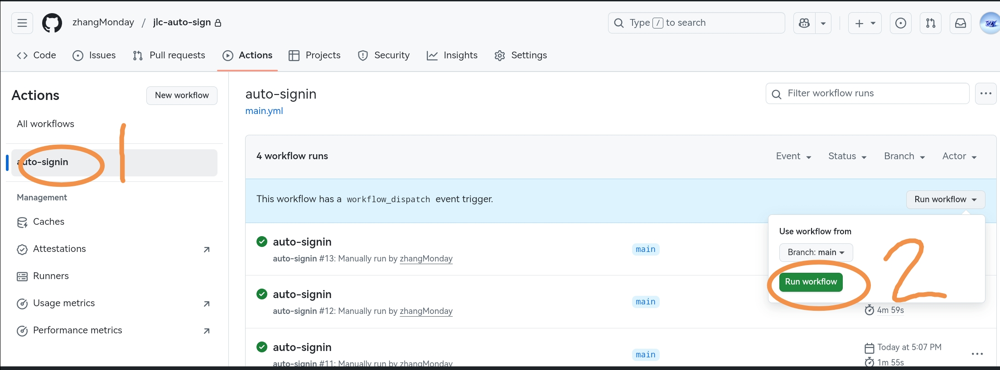
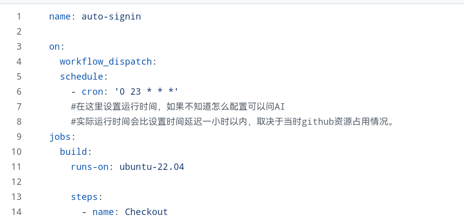
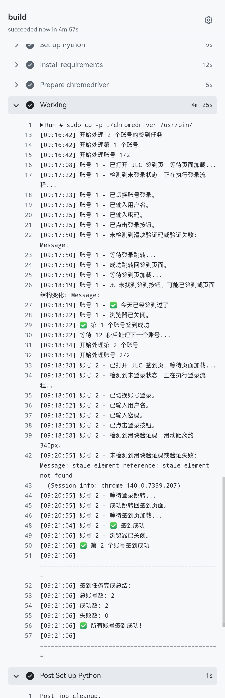

# 嘉立创自动签到工具  
*By zhangMonday*
[立创开源平台](https://oshwhub.com/)
[嘉立创金豆中心](https://activity.jlc.com/goods/goodsList?spm=JLC.MEMBER)

---

## 项目简介  
该项目利用 **Github Actions** 实现立创开源平台以及立创金豆的每天自动化签到，支持多账号签到与过滑块验证。

---

## 配置方法  

### 1. Fork 项目到自己的仓库  
- 访问项目页面，点击 `Fork` 按钮将项目复制到自己的仓库。  

---

### 2. 配置嘉立创账号和密码  
1. 进入你 Fork 的仓库，点击 **Settings** → **Secrets** → **New repository secret**。  
2. 添加以下两个密钥：  
   - **Name**: `JLC_USERNAME`  
     **Value**: 你的嘉立创登录账户邮箱或用户名，多账号用英文逗号分割，要和密码一一对应
   - **Name**: `JLC_PASSWORD`  
     **Value**: 你的嘉立创登录密码，多账号用英文逗号分割，要和账号一一对应

---

### 3. 配置 Actions 自动化执行  
1. 在你 Fork 的 GitHub 仓库中点击 **Actions**  
2. 按照图示方法启用 GitHub Actions

3. 点击 **Run workflow** 手动触发一次，如果运行结束出现绿色对勾则为成功

---

### 4. 定时自动化执行  
在 `.github/workflows/main.yml` 文件中，根据注释修改自动签到时间。  
如果不修改，默认自动签到时间为北京时间早上 7 点（23:00 UTC）。

实际运行时间会比设置时间延迟一小时以内，具体取决于当时 GitHub 资源占用情况。

---

### 成功运行结果

## 致谢  
本项目参考和复用了 [https://github.com/wmathor/Check_In](https://github.com/wmathor/Check_In) 的部分代码，感谢！
欢迎提交issue和PR，如果本项目对你有帮助，请给我点个star~
