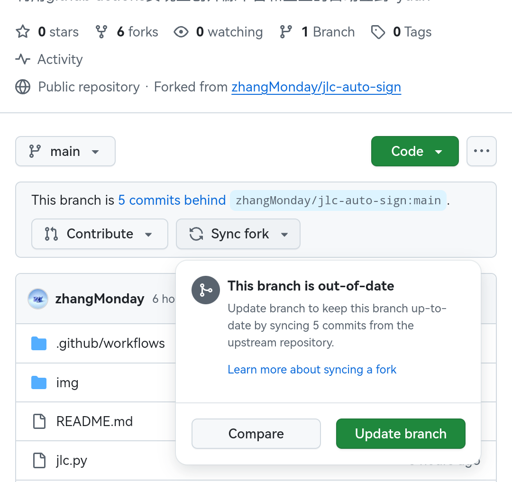
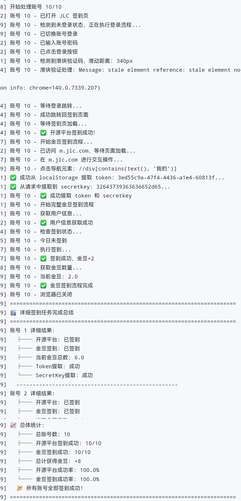

# 嘉立创自动签到工具  
*By zhangMonday*

[立创开源平台](https://oshwhub.com/)

[嘉立创金豆中心](https://activity.jlc.com/goods/goodsList?spm=JLC.MEMBER)

请确保你的立创账号已经在开源平台设置了昵称，否则开源平台自动签到将无法运行

每个账号完整跑完签到流程用时至多5分钟，Github Actions单次任务执行时长限制在6小时以内，因此不建议设置自动签到70个账号以上。如果有大量账号自动签到需求，可以手动多克隆几个本仓库来批量运行。

---

## 项目简介  
该项目利用 **Github Actions** 实现立创开源平台以及立创金豆的每天自动化签到

支持多账号签到

支持自动领取7日礼包和每月礼包

支持自动过滑块验证

支持自动通过登录信息抓包X-JLC-AccessToken和secretkey实现金豆签到

支持金豆奖励领取

支持异常自动重试

支持自动签到失败邮件提醒

---

## 配置方法  

### 1. Fork 项目到自己的仓库  
- 访问项目页面，点击 `Fork` 按钮将项目复制到自己的仓库。  


---

### 2. 配置嘉立创账号和密码/报错提醒
1. 进入你 Fork 的仓库，点击 **Settings** → **Secrets** → **New repository secret**。  
2. 添加以下两个密钥：  
   - **Name**: `JLC_USERNAME`  
     **Value**: 你的嘉立创登录账户邮箱/手机号/客编，多账号用英文逗号分割，要和密码一一对应
   - **Name**: `JLC_PASSWORD`  
     **Value**: 你的嘉立创登录密码，多账号用英文逗号分割，要和账号一一对应


3.错误退出功能(默认关闭)：

开启该功能后，当任何账号签到出现问题时，程序运行结束后会传递错误退出代码。Github Actions收到错误退出码后，会显示工作流运行失败，同时发送报错邮件给你。

因此开启该功能相当于接收签到失败的邮件提醒

开启方法:

在secret里再添加一个值
   - **Name**: `ERROR`  
     **Value**: `true`

---

### 3. 配置 Actions 自动化执行  
1. 在你 Fork 的 GitHub 仓库中点击 **Actions**  
2. 按照图示方法启用 GitHub Actions


3. 点击 **Run workflow** 手动触发一次，如果运行结束出现绿色对勾则为成功


---

### 4. 定时自动化执行  
在 `.github/workflows/main.yml` 文件中，根据注释修改自动签到时间。  
如果不修改，默认自动签到时间为北京时间早上 7 点（23:00 UTC）和晚上 19 点（11:00 UTC）

实际运行时间会比设置时间延迟一小时以内，具体取决于当时 GitHub 资源占用情况。


---

### 5. 获取更新

在你fork的仓库中找到sync fork，点击即可更新，如图



下一次自动签到会自动运行更新后的程序

推荐定期检查更新来优化脚本并获取最新功能

---

### 本地部署说明

如果你希望在本地环境运行此脚本，可以按照以下步骤进行配置：

环境要求

· Python 3.7 或更高版本

· Chrome 浏览器

· ChromeDriver（与Chrome版本匹配）

安装步骤

1. 克隆项目到本地

```bash
git clone https://github.com/zhangMonday/jlc-auto-sign.git
cd jlc-auto-sign
```

2. 安装Python依赖

```bash
pip install selenium requests
```

3. 安装ChromeDriver
   · 访问[ChromeDriver](https://developer.chrome.com/docs/chromedriver/downloads)下载页面
   · 下载与你的Chrome版本匹配的ChromeDriver
   
   · 将ChromeDriver添加到系统PATH中：
   
     · Windows: 解压到 C:\Windows\system32\
   
     · Linux/macOS: 解压到 /usr/local/bin/

5. 运行脚本

```bash
python jlc.py 账号1,账号2,账号3... 密码1,密码2,密码3...
```

---

### 成功运行结果（节选）


## 致谢  
本项目参考和复用了 [https://github.com/wmathor/Check_In](https://github.com/wmathor/Check_In) 的部分代码，感谢！

本项目参考了 [https://github.com/sudojia/AutoTaskScript](https://github.com/sudojia/AutoTaskScript/) 的嘉立创脚本，感谢！

欢迎提交issue和PR，如果本项目对你有帮助，请给我点个star~
